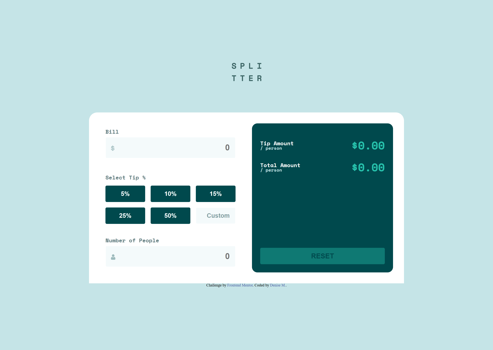

# Frontend Mentor - Tip calculator app solution

This is a solution to the [Tip calculator app challenge on Frontend Mentor](https://www.frontendmentor.io/challenges/tip-calculator-app-ugJNGbJUX). Frontend Mentor challenges help you improve your coding skills by building realistic projects.

## Table of contents

- [Overview](#overview)
  - [The challenge](#the-challenge)
  - [Screenshot](#screenshot)
  - [Links](#links)
- [My process](#my-process)
  - [Built with](#built-with)
  - [What I learned](#what-i-learned)
  - [Continued development](#continued-development)
  - [Useful resources](#useful-resources)
- [Author](#author)
- [Acknowledgments](#acknowledgments)

## Overview

### The challenge

Users should be able to:

- View the optimal layout for the app depending on their device's screen size
- See hover states for all interactive elements on the page
- Calculate the correct tip and total cost of the bill per person

### Screenshot



### Links

- [Solution](https://your-solution-url.com)
- [Live Site](https://rococo-tulumba-d19163.netlify.app/)

## My process

### Built with

- Semantic HTML5 markup
- CSS custom properties
- Flexbox
- CSS Grid
- Mobile-first workflow

### What I learned

What a challenge! I found this project to be quite difficult. Fine I'll admit it I required of every possible resource known to men.
This one dove deep into event listeners, I was stuck for about a week until I finally realized that there was no chance I'd be solving it solo atleast not in a timely manner.

My opinion, I did great w/ html, css needed a little problem solving.
Javascrit I re-wrote pseudo code with an idea of what I needed, but I just could not figure out the actual code for it.

```css
.input__icon--dollar::after {
  content: url(./images/icon-dollar.svg);
}

.input__icon--person::after {
  content: url(./images/icon-person.svg);
}
```

```js
customTipPercent.addEventListener("blur", (e) => {
  if (billAmount.value === "") {
    resetEverything();
    return;
  }
});
```

### Continued development

Javascript, Javascript, Javascript, that's gonna be my focus up until I feel a bit more confident in it. I think the best way for me to learn from this project would be styudying the code, where I kept going wrong, simply understand the code that solved it.

### Useful resources

- [Resets Stylesheet](http://meyerweb.com/eric/tools/css/reset/) - Perfect for reseting whatever styling the browser might add.

- [CSS Pseudo Classes](https://developer.mozilla.org/en-US/docs/Web/CSS/::after) - This helped me get the money and person icon inside the input box.
- [Manipulating the DOM](https://www.freecodecamp.org/news/javascript-document-object-model-explained/) - This article helped figuring out the DOM model.

- [Yoututbe: Code w/ Ali](https://www.youtube.com/watch?v=C2OPSdSac-g&t=990s) - Helped me understand what steps to take w/ the coding portion!

## Author

- Frontend Mentor - [@moncadad](https://www.frontendmentor.io/profile/moncadad)

## Acknowledgments

Shout out to the youtube tutorial I found for this project!!
